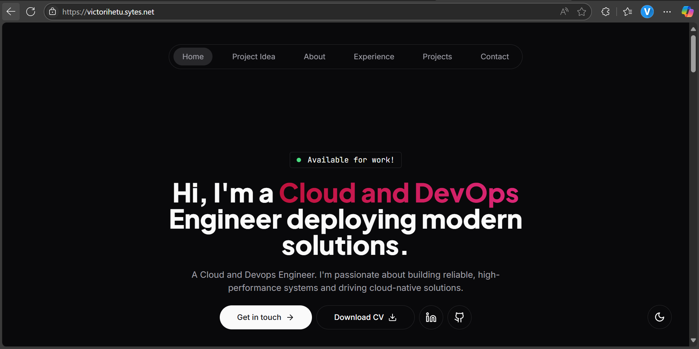

## ✅ **Deployment Details**
**Public IP**

16.171.44.92

**Webpage**

[View live Webpage](https://victorihetu.sytes.net)





## ✅ **Server Setup**

To set up a cloud-based server, a server provider was selected (**Hetzner Cloud**).

1. Log in to [Hetzner Console](https://console.hetzner.cloud/) and add server.
2. Enter your preferred region/location, server name, server OS (ubuntu), hardware specification, and instance type.
4. Select an already existing ssh key file to add it to the server or generate and add a new one.
5. Configure a public and private IP for the server and allow communication on the network.
6. Select storage volume (the default storage volume is fine).
7. Once provisioned, the server would start up by default.

---

## ✅ **Accessing the Server**

To access the newly created sserver, SSH into it with via any of your preferred ssh clients (in my case Termius):

connect to the host by adding the server hostname/IP and then specifying the SSH key to connect with.

---

## ✅ **Setting Up Server for Deployment**

1. Update the package list:
   sudo apt update

2. Install Node.js LTS version (16.x):
   curl -fsSL https://deb.nodesource.com/setup_current.x | sudo -E bash -
   sudo apt install -y nodejs

3. Verify the installation:
   node -v
   npm -v

4. Install Nginx:
   sudo apt install nginx

5. Start Nginx:
   sudo systemctl start nginx

6. Enable Nginx to start on boot:
   sudo systemctl enable nginx


## ✅ **Webpage Deployment**

The portfolio was created with **Next.js** (a modern React framework) and pushed to GitHub.

To deploy the project:

1. **SSH into the EC2 instance** (if you haven’t already):

   ```bash
     ssh username@your-server-ip
   ```

2. Navigate to the directory where you want to store your project (in my case /var/www):
   cd /var/www

3. **Clone your repository from GitHub:**

   ```bash
   git clone https://github.com/your-username/my-portfolio.git
   cd my-portfolio

   ```

3. **Install Your Project Dependencies:**

   #Install the dependencies for your Next.js app:
   npm install

4. **Build and start your Next.js project:**

   #Build your Next.js app for production:
   npm run build

   #Start your Next.js app:
   npm run start

   #application would be started on http://localhost:3000

   (The default port is `3000`.)

**Bonus:** To ensure the service runs in the background and automatically starts up on reboots or on crashes, install **PM2** and run the app with it.

   #First, install PM2 globally if you don't have it already:
   sudo npm install -g pm2

   #Navigate to your project directory and start your app using PM2:
   pm2 start npm --name "my-portfolio" -- start

   #To ensure the app starts on system restart, save the current PM2 process list:
   pm2 save


---

## ✅ **Obtaining a Domain or Subdomain**

Free (sub)domain names can be obtained from providers like:
- [NOIP](https://my.noip.com)
- [FreeDNS (afraid.org)](https://freedns.afraid.org)

Or you can purchase a domain from providers like **Namecheap** or **GoDaddy**.

## ✅ **Set Up DNS for Custom Domain**
1. Log in to your domain registrar e.g., GoDaddy, Namecheap (In my case NoIP).

2. Add an A record in your DNS settings/create a hostname under your domain:
   - Host: @ or www (depending on your preference)
   - Type: A
   - Value: Your server's public IP address

3. Wait for DNS propagation (could take anywhere from a few minutes to 24 hours).


---

## ✅ **Setting up NGINX Reverse Proxy**

1. **Create a new Nginx configuration file for your app:**
   sudo nano /etc/nginx/sites-available/your-app-name

2. **Add the following configuration to the file:**

      # HTTP server block (redirects HTTP to HTTPS)
      server {
         listen 80;
         server_name your-custom-domain.com;

         # Redirect all HTTP traffic to HTTPS
         return 301 https://$host$request_uri;
      }

      # HTTPS server block (handles HTTPS traffic)
      server {
         listen 443 ssl;
         server_name your-custom-domain.com;

         # SSL certificate paths (Certbot will update these)
         ssl_certificate /etc/letsencrypt/live/your-custom-domain.com/fullchain.pem;
         ssl_certificate_key /etc/letsencrypt/live/your-custom-domain.com/privkey.pem;

         # Optional SSL settings
         include /etc/letsencrypt/options-ssl-nginx.conf;
         ssl_dhparam /etc/letsencrypt/ssl-dhparams.pem;

         # Reverse proxy to your Next.js app
         location / {
            proxy_pass http://localhost:3000;  # Your Next.js app running on port 3000
            proxy_http_version 1.1;
            proxy_set_header Upgrade $http_upgrade;
            proxy_set_header Connection 'upgrade';
            proxy_set_header Host $host;
            proxy_cache_bypass $http_upgrade;
         }
      }
   ```

   **Note:** Since we are yet to generate the certificate, comment out all lines relating to ssl or certificate:


3. **Test your configuration:**

   ```bash
   sudo nginx -t
   ```

4. **Reload NGINX:**

   ```bash
   sudo systemctl reload nginx
   ```

Your domain should now serve your landing page over **HTTPS**!

---

## ✅ **Securing the Website**

To secure your website, obtain a free SSL certificate from **Let’s Encrypt** using **Certbot**.

1. **Install Certbot for NGINX:**

   sudo apt install certbot python3-certbot-nginx -y


2. **Run Certbot to automatically configure SSL for your domain:**

sudo certbot --nginx -d your-custom-domain.com -d www.your-custom-domain.com

   #Certbot will:

    Automatically generate the SSL certificates.

    Modify your Nginx configuration to use those certificates.

    Reload Nginx to apply the SSL configuration.

3. **Verify SSL:** Once Certbot completes, you can visit https://your-custom-domain.com to verify that your site is being served securely over HTTPS.
